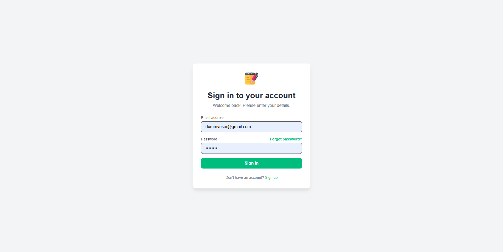
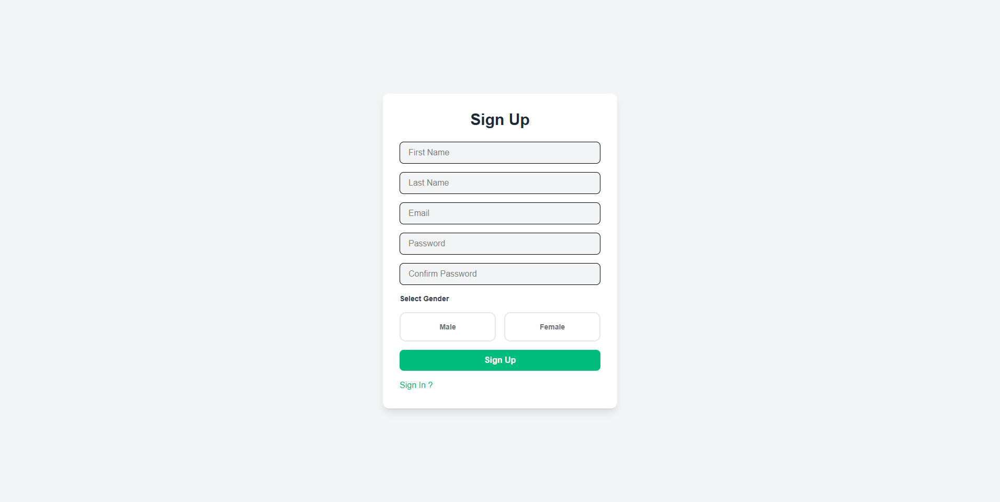
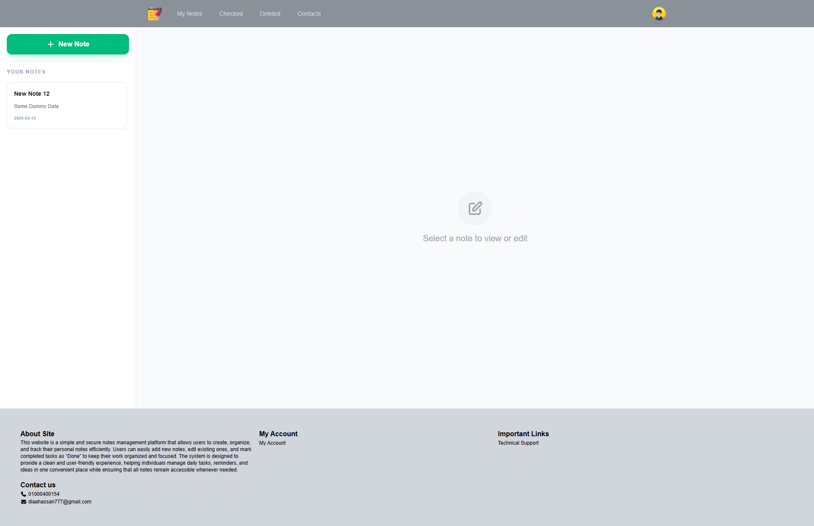
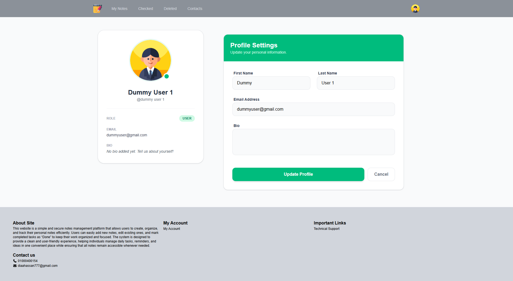

# Blog App

A full-stack notes/blog management application with user authentication, built with React and Node.js/Express.

## Project Structure

```
Blog App/
├── Client/                 # React frontend (Vite)
│   ├── src/
│   │   ├── App.jsx
│   │   ├── main.jsx
│   │   ├── userContext.jsx      # User context provider
│   │   ├── userData.jsx          # User data provider
│   │   ├── Components/
│   │   │   ├── NavBar/
│   │   │   ├── SideBar/
│   │   │   ├── Footer/
│   │   │   └── OverlayModal/
│   │   ├── Home/            # Main app pages
│   │   │   ├── Home.jsx
│   │   │   ├── Checked/
│   │   │   ├── Deleted/
│   │   │   └── Profile/
│   │   ├── Signing/         # Auth pages
│   │   │   ├── Sign In/
│   │   │   └── Sign Up/
│   │   └── Services/
│   │       └── notes.service.js
│   ├── package.json
│   ├── vite.config.js
│   └── eslint.config.js
│
└── Server/                  # Node.js/Express backend
    ├── Src/
    │   ├── index.js
    │   ├── Common/
    │   │   ├── Enums/       # Gender, Role enums
    │   │   ├── Middlewares/ # Auth, Error middlewares
    │   │   └── Utils/       # Encryption, JWT, validation utilities
    │   ├── DB/              # MongoDB models & connection
    │   │   └── models/
    │   │       ├── users.model.js
    │   │       └── notes.model.js
    │   └── Modules/         # API modules
    │       ├── Auth/
    │       ├── Notes/
    │       └── Users/
    ├── Config/
    │   ├── config.service.js
    │   └── env.watcher.js
    ├── main.js
    ├── app.bootstrap.js
    └── package.json
```

## Tech Stack

### Frontend
- **React** 19.2.0 - UI framework
- **Vite** 7.2.4 - Build tool & dev server
- **React Router** 7.13.0 - Client-side routing
- **TailwindCSS** 4 - Styling
- **Headless UI** 2.2.9 - Unstyled accessible components
- **Heroicons** 2.2.0 - Icon library
- **Axios** 1.13.4 - HTTP client
- **FontAwesome** 7.1.0 - Additional icons

### Backend
- **Node.js** - Runtime
- **Express** 5.2.1 - Web framework
- **MongoDB** (via Mongoose 9.1.6) - Database
- **JWT** 9.0.3 - Authentication tokens
- **bcrypt** 6.0.0 - Password hashing
- **CORS** - Cross-origin requests
- **dotenv** - Environment variables

## Features

- **User Authentication**
  - Sign up with email and password
  - Sign in with JWT tokens
  - Password encryption with bcrypt
  - Token-based authorization

- **Notes Management**
  - Create, read, update, delete notes
  - Mark notes as checked/completed
  - Soft delete with recovery
  - View separate sections for active, checked, and deleted notes

- **User Profile**
  - View and edit user profile
  - Gender selection (Male/Female)
  - Profile picture based on gender

- **Responsive UI**
  - Mobile-friendly navigation
  - Sidebar navigation
  - User dropdown menu
  - Notification bell (UI ready)

## Installation & Setup

### Prerequisites
- Node.js (v18+)
- pnpm package manager
- MongoDB instance (local or cloud)

### Backend Setup

```bash
cd Server

# Install dependencies
pnpm install

# Create .env file with:
# NODE_ENV=development
# PORT=5000
# MONGODB_URI=mongodb://localhost:27017/blog-app
# JWT_SECRET=your_jwt_secret_key
# JWT_EXPIRE=7d

# Start development server
pnpm run dev

# Start production server
pnpm start
```

### Frontend Setup

```bash
cd Client

# Install dependencies
pnpm install

# Create .env file with:
# VITE_API_URL=http://localhost:5000

# Start development server
pnpm run dev

# Build for production
pnpm build

# Preview production build
pnpm preview
```

## Available Scripts

### Client
- `pnpm run dev` - Start development server (Vite)
- `pnpm run build` - Build for production
- `pnpm run lint` - Run ESLint
- `pnpm run preview` - Preview production build

### Server
- `pnpm run dev` - Start development server with file watching
- `pnpm start` - Start production server

## API Endpoints

### Authentication
- `POST /auth/signUp` - Register new user
- `POST /auth/signIn` - Login user

### Users
- `GET /users/userData` - Get authenticated user data
- `PUT /users/profile` - Update user profile

### Notes
- `GET /notes` - Get user's notes
- `POST /notes` - Create new note
- `PUT /notes/:id` - Update note
- `DELETE /notes/:id` - Delete note
- `GET /notes/checked` - Get checked notes
- `GET /notes/deleted` - Get deleted notes

## Context & State Management

### UserContext
Located in `src/userContext.jsx` - Simple React Context for user state
- Provides: `user` object and `setUser` function
- Used in: NavBar, Profile, and other authenticated components

### UserProvider
Located in `src/userData.jsx` - Context Provider component
- Fetches user data on app initialization
- Handles token validation
- Provides user data to entire app

## Security Features

- JWT-based authentication
- Password hashing with bcrypt
- Token validation middleware
- CORS configuration
- Encrypted sensitive data
- Environment variable protection

## File Structure Details

### Client Components
- **NavBar** - Navigation bar with user dropdown
- **SideBar** - Sidebar navigation
- **Footer** - Footer component
- **OverlayModal** - Reusable modal
- **Gender Selection** - Gender picker component

### Backend Utilities
- `jwt.utils.js` - JWT creation and verification
- `encrypt.utils.js` / `decrypt.utils.js` - Data encryption
- `hash.utils.js` - Password hashing
- `error.utils.js` - Error handling
- `res.utils.js` - Response formatting
- `success.utils.js` - Success response formatting

## Environment Variables

### Backend (.env)
```
NODE_ENV=development
PORT=5000
MONGODB_URI=mongodb://localhost:27017/blog-app
JWT_SECRET=your_secret_key
JWT_EXPIRE=7d
```

### Frontend (.env)
```
VITE_API_URL=http://localhost:5000
```

## Error Handling

- Centralized error middleware in backend
- Global error handler in frontend
- Validation on both client and server
- User-friendly error messages

## Development Workflow

1. Frontend runs on `http://localhost:5173` (Vite default)
2. Backend runs on `http://localhost:5000` (configurable)
3. MongoDB connection required for backend
4. Token stored in localStorage on client
5. CORS configured to allow frontend requests

## Future Enhancements

- Rich text editor for notes
- Note categories/tags
- Shared notes functionality
- Search and filtering
- Dark mode toggle
- Notification system
- File attachments
- Note versioning/history

## Author

Diaa El-Din Hassan

## License

ISC

## Support

For issues or questions, please check the project structure and ensure:
- MongoDB is running
- Environment variables are configured
- Dependencies are installed with `pnpm install`
- Ports 5000 (backend) and 5173 (frontend) are available

## Screenshots

### Sign In


### Sign Up


### Dashboard


### Profile

